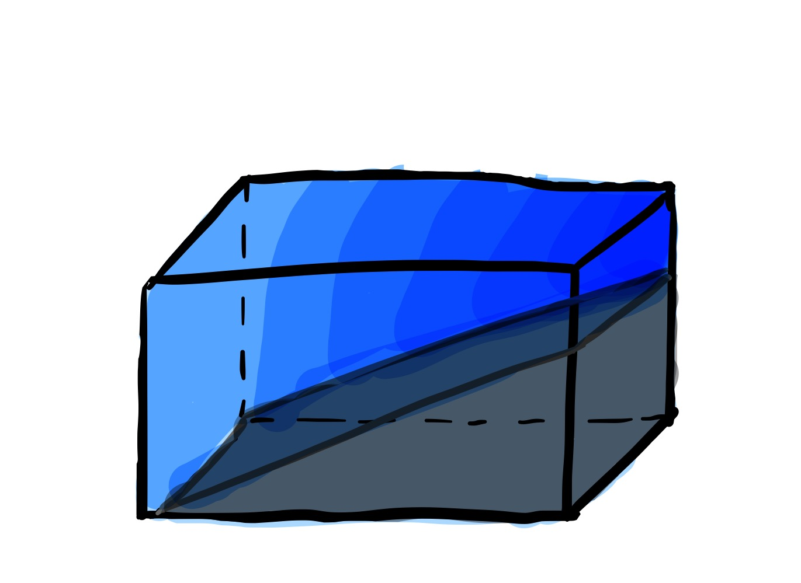

## A story about the baroclinic instability over a sloping bottom

A summary list of functions used for data visualisation in Thesis Chapter 2 and Chapter 3.
- The NetCDF files sourced from post-processing SUNTANS modelling 
- Integrate with some calculation/QAQC functions

### Motivation 
- The confirmed and well-studied mesoscale eddy over the Australian North West Shelf

- However, there are unresolved smaller scales dynamics along the coast

#### Lateral (density) gradients are essential to generate baroclinic instability

A simple example of the formation of lateral gradients 
1. If we have a tank full of water with a __flat__ bottom, and we apply surface cooling

   
   
   
   With time, we observe the water cools down at the __same rate__
   
   

2. If we have a tank full of water with a __sloping__ bottom, and we apply surface cooling
   
   
   

   With time, we observe the water cools down __faster__ in the shallower region than in the deeper region
   
   

   Hence __forms the lateral temperature/density gradients__
   
   

   
### Numerical modelling with SUTNANS
- Model set-up

### Result at a glance
- Eddies observed in the idealised simulation

- Schematic diagram of cross-shelf flow

